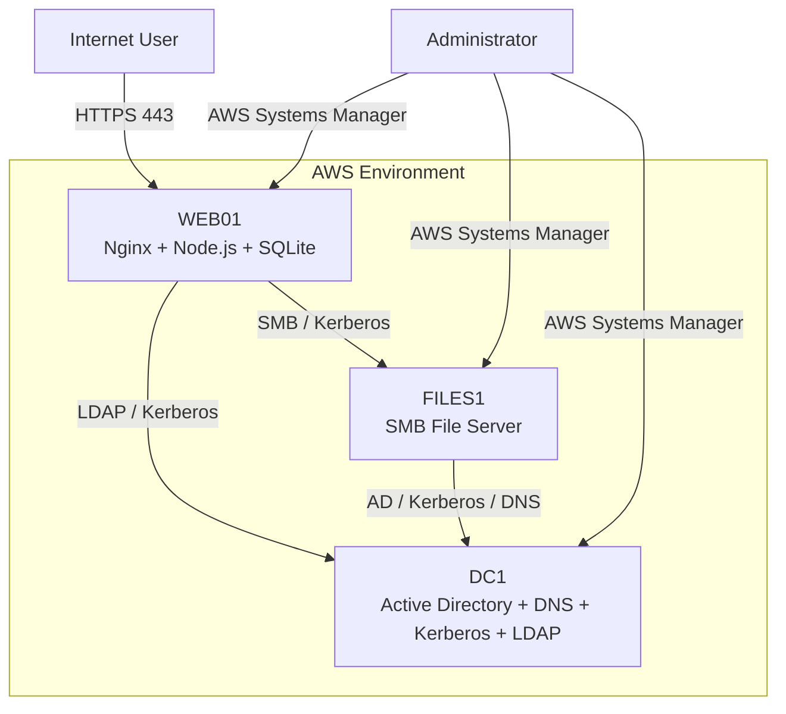

# AZSAGH Architecture

## Overview

AZSAGH is a secure enterprise lab built to demonstrate how public web services, identity infrastructure, authentication systems, and internal file services can be separated and protected.

The environment uses three AWS EC2 servers with different responsibilities:

- **WEB01** — public web and application server
- **DC1** — Active Directory, DNS, Kerberos, and LDAP
- **FILES1** — internal SMB file server

The design separates the public-facing application from identity and file-storage services.

---

## High-Level Architecture



---

## WEB01

WEB01 hosts the public application.

Main components:

- Nginx
- Node.js
- Express
- SQLite
- HTTPS/TLS
- Authentication and authorization
- Audit logging

Public users connect to Nginx over HTTPS.

Node.js is not directly exposed to the Internet.

```text
Internet
   |
   | HTTPS 443
   v
Nginx
   |
   | localhost
   v
127.0.0.1:3000
   |
   v
Node.js
```

This allows Nginx to act as the public entry point while keeping the application backend private to WEB01.

---

## DC1

DC1 provides centralized identity services.

Main components:

- Samba Active Directory Domain Controller
- DNS
- Kerberos
- LDAP

### Active Directory

Stores enterprise identities such as users and groups.

### DNS

Allows systems to locate domain services.

### Kerberos

Authenticates domain identities and issues tickets.

### LDAP

Allows authorized applications and systems to query directory information.

Conceptually:

```text
WEB01
   |
   | LDAP query authenticated with Kerberos
   v
DC1
   |
   v
Active Directory
```

---

## FILES1

FILES1 provides the internal company file-sharing service.

Main component:

- Samba SMB server

Example share:

```text
\\files1.corp.azsagh.com\company
```

Kerberos authenticates the user before SMB evaluates file permissions.

```text
User
  |
  | Kerberos TGT
  v
Kerberos
  |
  | CIFS service ticket
  v
FILES1
  |
  | SMB authorization
  v
Company Files
```

Authentication and authorization remain separate:

- **Kerberos** confirms the user's identity.
- **SMB permissions** decide what that user may read or modify.

---

## Kerberos Architecture

A user first authenticates and receives a Ticket Granting Ticket.

```text
Password
   |
   v
Kerberos KDC
   |
   v
TGT
```

The TGT can then be used to request service-specific tickets.

Examples:

```text
cifs/files1.corp.azsagh.com
```

Kerberos credential for SMB on FILES1.

```text
ldap/dc1.corp.azsagh.com
```

Kerberos credential for LDAP on DC1.

The user's password does not need to be repeatedly sent to each service.

---

## Administrative Access

Administrative access does not require exposing SSH directly to the public Internet.

AWS Systems Manager is used as the management path.

```text
Administrator
      |
      | AWS authentication
      v
AWS Systems Manager
      |
      v
SSM Agent
      |
      v
EC2 Server
```

SSH and SFTP can operate through the Systems Manager connection.

This allows public SSH exposure to remain disabled.

---

## Network Separation

The environment separates public and internal services.

### Public-facing

```text
80   HTTP
443  HTTPS
```

### Internal or restricted

```text
22    SSH
53    DNS
88    Kerberos
389   LDAP
445   SMB
3000  Node.js
```

AWS Security Groups determine which systems are allowed to communicate with each service.

Security Group references can be used instead of fixed IP addresses so that access can be granted based on server role.

---

## Why Three Servers?

### Security

A compromise of the public web server does not automatically place Active Directory or company files on the same operating system.

### Isolation

Each server has separate processes, permissions, network controls, and operating-system boundaries.

### Reliability

One service can be restarted, updated, or maintained without shutting down the entire environment.

---

## Data Flow

A normal public request follows:

```text
User
 ↓
DNS
 ↓
HTTPS
 ↓
Nginx
 ↓
Node.js
 ↓
SQLite
```

An enterprise identity query follows:

```text
WEB01
 ↓
Kerberos authentication
 ↓
LDAP
 ↓
DC1
 ↓
Active Directory
```

An SMB file-access flow follows:

```text
User
 ↓
Kerberos TGT
 ↓
CIFS service ticket
 ↓
FILES1
 ↓
SMB authorization
 ↓
Company share
```

---

## Design Goal

The architecture demonstrates practical enterprise concepts including:

- Network segmentation
- Centralized identity
- Kerberos authentication
- LDAP directory queries
- SMB file sharing
- Reverse proxy architecture
- Private application backends
- Restricted administrative access
- Defense in depth
- Least privilege
